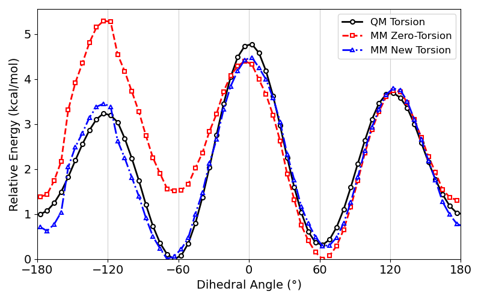

<b>This tutorial explains how to reparameterize molecular mechanics (MM) dihedral angles using a quantum mechanical (QM) approach.</b>

It requires Gaussian, GROMACS, a recent version of AmberTools and parmed.

---

 
<h2> 
 <b>I - Dihedral angle scan with QM </b> 
</h2>

 

We start by creating our molecule in GaussView and performing a dihedral scan using the ModRedundant input section: 

<pre style="color: white; background-color: black;">
# opt=modredundant b3lyp/6-31g(d,p) scf=tight

Title Card Required

0 1
 C                  1.39817300    0.52720100    0.22441400
 H                  2.01440700    1.35294300   -0.16438900
 H                  1.44317500    0.57662300    1.32520700
 C                 -0.04224600    0.70264600   -0.23892700
 H                 -0.06319300    0.64168000   -1.33558100
 H                 -0.39046500    1.70533500    0.03570800
 C                 -1.00011300   -0.33618100    0.34929500
 H                 -0.65273900   -1.34722800    0.09797700
 H                 -1.00776200   -0.25692900    1.44251900
 O                  1.86718200   -0.73237700   -0.25133700
 H                  2.76112600   -0.86758100    0.08668800
 O                 -2.34813900   -0.12614100   -0.05961100
 H                 -2.39178000   -0.29869800   -1.00922800

10 1 4 7 S 60 6.0
12 7 4 1 F

</pre>

Here we use the 1,3-propanediol molecule as an example, scanning the 10 1 4 7 dihedral while keeping the 12 7 4 1 dihedral frozen to avoid energy jumps. Note that the initial geometry of the scan should correspond to a global minimum in the potential energy surface. If possible, use a higher level of theory.

 

Then we extract the optimized geometries from the Gaussian scan output using the <a href="https://arvpinto.github.io/GAFF2_dihedral_parameterization/scan_qm/gaussian2xyz.py" target="_blank">gaussian2xyz.py</a> script (authored by Tomasz Borowski and Zuzanna Wojdyła) and run single-point calculations with a high level of theory:

<pre style="color: white; background-color: black;">
#The script generates the scan_geoms.xyz file which has all the coordinates and corresponding energies
python gaussian2xyz.py propanediol_scan.log scan > scan_geoms.xyz

#We split the file to create individual coordinate files
split -l 15 scan_geoms.xyz

#Using a for loop, we create new Gaussian input files, which will be used for single-point calculations
for i in x*; do 
   (echo "#p M062X/6-311++G(d,p)" ; echo "" ; echo "SP" ; echo "" ; echo "0 1" ; tail -n +3 "$i" ; echo "") > "$i".com 
done

#And we run the calculations in the background:
nohup $(for i in *com ; do g09 "$i" ; done) &

#Finally we can use the <a href="https://arvpinto.github.io/GAFF2_dihedral_parameterization/scan_qm/single_point/gaussian_dihedral.py" target="_blank">gaussian_dihedral.py</a> script to extract the energy profile for dihedral rotation:
python gaussian_dihedral.py 10 1 4 7 x*log > qm_scan.dat
</pre>

    

Note, while the dihedral angle scan is carried out with a lower level of theory, the single-point calculations should be carried out with an adequate method such as MP2/cc-pVTZ. Here we use M062X/6-311++G(d,p) to exemplify.

 
<h2> 
 <b>II - Dihedral angle scan with MM </b> 
</h2>

 

To perform an MM dihedral scan, the molecule is first parameterized with GAFF2:
<pre style="color: white; background-color: black;">
antechamber -fi gout -i propanediol.log -fo mol2 -o propanediol.mol2 -nc 0 -c abcg2 -pf y -at gaff2
antechamber -fi mol2 -i propanediol.mol2 -fo ac -o propanediol.ac -pf y
prepgen -i propanediol.ac -o propanediol.prepin
parmchk2 -i propanediol.prepin -f mol2 -o propanediol.frcmod -s gaff2

tleap
>source leaprc.gaff2
>loadamberprep propanediol.prepin
>mol = loadmol2 propanediol.mol2
>saveoff mol propanediol.lib
>quit

tleap
>source leaprc.gaff2
>loadamberparams propanediol.frcmod
>loadoff propanediol.lib
>loadamberprep propanediol.prepin
>mol = loadmol2 propanediol.mol2
>saveAmberParm mol propanediol.prmtop propanediol.rst7
>quit
</pre>

Then the coordinates and parameters are converted to GROMACS format:
<pre style="color: white; background-color: black;">
python amb2gmx.py propanediol.prmtop propanediol.rst7
gmx editconf -f propanediol_converted.gro -bt triclinic -d 1.0 -o propanediol_converted.gro
</pre>

To carry out the dihedral scan, we introduce the following section in the topology after the parameters:
<pre style="color: white; background-color: black;">
#ifdef POSRES
[ dihedral_restraints ]
10 1 4 7 1 DIHE_VALUE 0 10000
12 7 4 1 1 177.95895 0 10000
#endif
</pre>

And then we run the calculations with the <a href="https://arvpinto.github.io/GAFF2_dihedral_parameterization/scan_mm/min_steep_restr.mdp" target="_blank">min_steep_restr.mdp</a> file:
<pre style="color: white; background-color: black;">
for i in $(tail -n +2 qm_scan.dat | awk '{print $1}'); do 
    cp propanediol_converted.top propanediol_converted_dihe.top 
    sed -i 's/DIHE_VALUE/'"$i"'/g' propanediol_converted_dihe.top 
    gmx grompp -f min_steep.mdp -c propanediol_converted.gro -p propanediol_converted_dihe.top -o dihe_"$i".tpr 
    gmx mdrun -deffnm dihe_"$i"  
done
</pre>

This will result in a dihedral energy profile with the dihedral term that we aim to parameterize included, however we need to calculate the energy profile without this dihedral term (see <a href="https://pubs.acs.org/doi/10.1021/acs.jpca.0c10845" target="_blank">https://pubs.acs.org/doi/10.1021/acs.jpca.0c10845</a>). This can be done by deleting the term from the topology file and running single-point calculations on the previously produced structures with the <a href="https://arvpinto.github.io/GAFF2_dihedral_parameterization/scan_mm/single_point/min_steep_sp.mdp" target="_blank">min_steep_sp.mdp</a> file:

<pre style="color: white; background-color: black;">
for i in dihe_*gro; do 
   gmx grompp -f min_steep_sp.mdp -c "$i" -p propanediol_converted.top -o "$(echo "$i" | sed 's/\.gro//')".tpr 
   gmx mdrun -deffnm "$(echo "$i" | sed 's/\.gro//')" 
done
</pre>

Then the zero-torsion energy profile can be extracted with the <a href="https://arvpinto.github.io/GAFF2_dihedral_parameterization/scan_mm/single_point/gromacs_dihedral.py" target="_blank">gromacs_dihedral.py</a> script:
<pre style="color: white; background-color: black;">
python3 gromacs_dihedral.py dihe_*log
</pre>

    

 
<h2> 
 <b>III - Fitting the dihedral energy term </b> 
</h2>

Now we can use the <a href="https://arvpinto.github.io/GAFF2_dihedral_parameterization/dihedral_fit/least_squares_fit.py" target="_blank">least_squares_fit.py</a> script to fit Fourier (cos/sin) series to the target dihedral energy profile:

<pre style="color: white; background-color: black;">
python least_squares_fit.py --qm qm_scan.dat --mm mm_scan.dat --out dihedral.itp --nmax 3 --refine

...
Fitted up to n=3, RMSD=0.928483 kJ/mol
Terms (multiplicity, K[kJ/mol], phase_deg):
  n= 1    K=  4.604625 kJ/mol    phase=  70.7828 deg
  n= 2    K=  1.353402 kJ/mol    phase= -12.2563 deg
  n= 3    K=  0.289076 kJ/mol    phase=  96.7451 deg
...
</pre>

Finally, we can replace the terms in the original topology and re-run the MM single-point calculations to see if the fit adequately leads to the reproduction of the QM torsional profile. Here we use --nmax 3 instead of 1 to improve the fitting to the QM profile, however, this has to be chosen carefully to avoid overfitting. 

    

 
<h2> 
 <b>IV - Add dihedral parameters to topology </b> 
</h2>

The dihedral parameters are usually derived from a molecular fragment chosen to represent larger molecules in a complex topology. In this section, we'll delete the original dihedral parameters and add the new ones using parmed. 

We start by building our complex system, by replicating the 1,3-propanediol cell and parameterizing it:

<pre style="color: white; background-color: black;">
echo -e "box x 5 y 5 z 5 alpha 90 beta 90 gamma 90 \n replicatecell out propanediol_system.mol2 all " | cpptraj propanediol.mol2 -y propanediol.mol2

tleap
>source leaprc.gaff2
>loadamberparams propanediol.frcmod
>loadoff propanediol.lib
>loadamberprep propanediol.prepin
>mol = loadmol2 propanediol_system.mol2
>saveAmberParm mol propanediol_system.prmtop propanediol_system.rst7
>quit
</pre>

Now we print the list of dihedral angles equivalent to the one we parameterized previously:

<pre style="color: white; background-color: black;">
echo "printDihedrals @O1 @C1 @C2 @C3" | parmed propanediol_system.prmtop | grep "oh" | awk '{print $1,$5,$9,$13}' | sed -E 's/([0-9]+)/@\1/g' > dihedral_list.dat
</pre>

And we create the parmed input file to replace the parameters (don't forget to convert the parameters from kJ/mol to kcal/mol):

<pre style="color: white; background-color: black;">
touch dihedrals_parmed.in
while read line; do
  echo "deleteDihedral $line" >> dihedrals_parmed.in
done < dihedral_list.dat
while read line; do
  echo "addDihedral $line 4.604625 1 70.7828" >> dihedrals_parmed.in
  echo "addDihedral $line 1.353402 2 -12.2563" >> dihedrals_parmed.in
  echo "addDihedral $line 0.289076 3 96.7451" >> dihedrals_parmed.in
done < dihedral_list.dat
echo "parmout propanediol_system_newdihe.prmtop" >> dihedrals_parmed.in
 
parmed propanediol_system.prmtop -i dihedrals_parmed.in
</pre>
